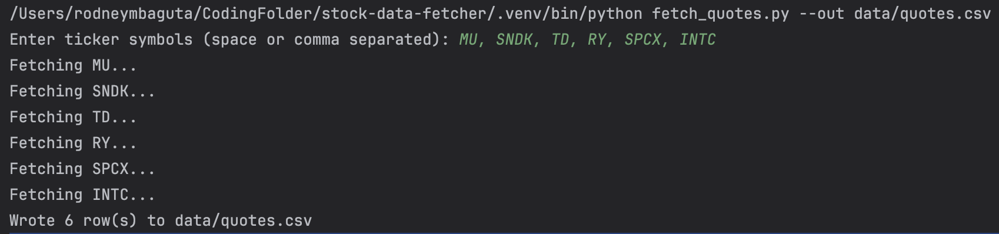
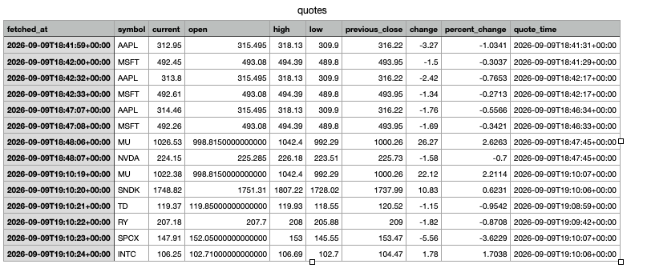

### stock-data-fetcher

A command-line tool that pulls live stock quotes from the Finnhub API and appends them to a CSV, building up a time series you can run on a schedule. Accepts tickers as arguments or interactively, handles rate limits and unknown symbols, and keeps credentials out of source via .env. Covered by 15 pytest unit tests that run without network access.

### Features
Fetches current price, open, high, low, previous close, and change for any US-listed symbol
Two input modes: pass tickers as arguments, or run with none and get prompted
Appends rather than overwrites, so repeated runs accumulate a price history
Paces requests to stay inside Finnhub's free-tier rate limit
Skips unknown symbols and failed requests without aborting the run
API key loaded from .env, never committed

### Requirements
Python 3.9 or later
A free Finnhub API key

### Setup
git clone https://github.com/rodneymbaguta15/stock-data-fetcher.git
cd stock-data-fetcher

python -m venv .venv
source .venv/bin/activate          # Windows: .venv\Scripts\activate

pip install -r requirements.txt

### Run the program
Right click the fetch_quotes.py or click the 'Run' button
In terminal: $ python fetch_quotes.py --out data/quotes.csv

### Building a price history
Because each run appends, scheduling the script gives you your own intraday time series. To schedule a pull every 15min for AAPL and MSFT.
*/15 9-16 * * 1-5 cd /path/to/stock-data-fetcher && .venv/bin/python fetch_quotes.py AAPL MSFT --out data/quotes.csv  

### Testing 
Right click the test_fecth_quotes.py and run the file
Terminal: pytest test_fetch_quotes.py -v

### Output Example
Terminal Output

Exported Data in Excel

### Improvements
- Batch write
- No historical data for now (Finnhub free tier limitation)
- Limited to 60 API calls per minute (Finnhub free tier limitation)
- Swap CSV for SQLite to get indexing and deduplication without adding a server
- Load the accumulated CSV into pandas for returns, moving averages, or correlation analysis
